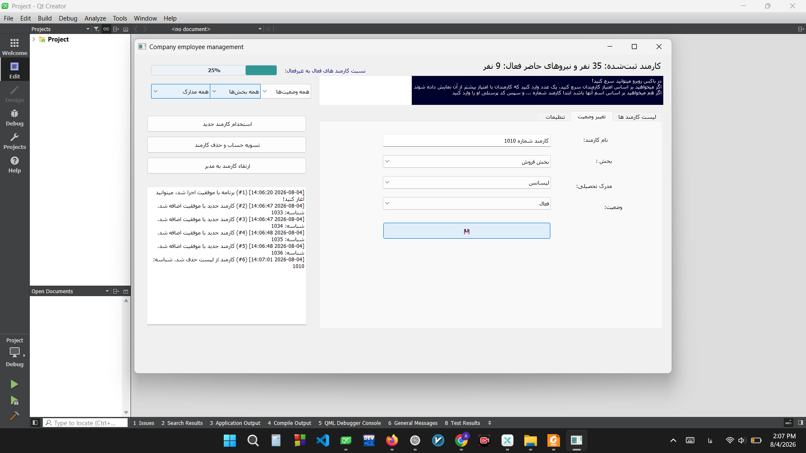
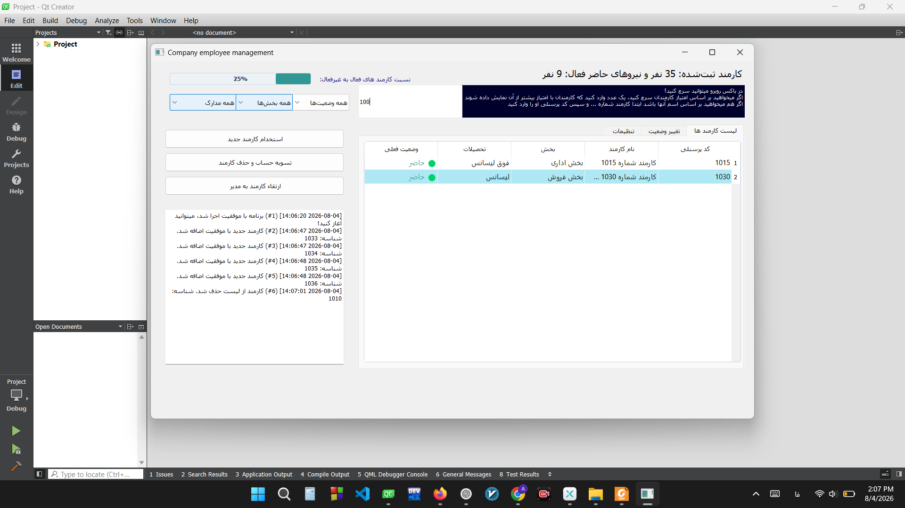
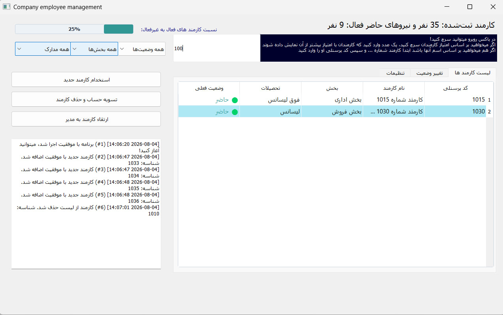

# Employee Management System

A desktop Employee Management & Office Automation application built with **C++** and **Qt Framework** for the Advanced Programming course[cite: 1]. The system provides an interactive graphical interface to streamline corporate personnel management, track status logs, evaluate performance, and ensure persistent data storage across sessions[cite: 1].

---

## Key Features

- **Dynamic Personnel Operations:** Add, update, fire, or promote employees to Manager with dynamic UI state updates.
- **Smart Dual-Mode Search & Multi-Filtering:** 
  - Text input automatically detects and filters by **Employee Name** or **Personnel ID**[cite: 1].
  - Numeric input filters by **Performance Score** threshold[cite: 1].
  - Additional categorical filtering by Department, Qualification, and Work Status[cite: 1].
- **Real-Time Statistics Dashboard:** Visual table views, custom color coding (highlighting Managers in blue), and live percentage tracking for active staff[cite: 1].
- **Persistent Data Storage:** Automatic serialization and deserialization of records to disk (`company_database.txt`)[cite: 1].
- **Live System Logger:** Timestamped event tracking for all runtime actions displayed directly within the application window[cite: 1].

---

## System Architecture & Engineering

The application follows a modular 3-tier desktop architecture:

- **Presentation Layer (Qt UI):** Developed using Qt Widgets, custom table styles, and signal/slot architecture for event-driven user interaction.
- **Business Logic Layer (OOP Core):**
  - **Inheritance & Polymorphism:** Abstract base class `Employee` extended by `Manager` with overridden performance evaluation logic[cite: 1].
  - **Composition:** `Company` class managing the life cycle and runtime collection of employee instances[cite: 1].
  - **Memory Safety:** Explicit heap allocation management and clean object deallocation (`qDeleteAll` / virtual destructors) to guarantee zero memory leaks[cite: 1].
- **Persistence Layer:** Disk file I/O operations managing system state persistence upon changes and application shutdown[cite: 1].

---

## Technologies Used

- **Language:** C++17
- **Framework:** Qt 5.x / Qt 6.x (Qt Widgets, QObjects)
- **Design Concepts:** Object-Oriented Programming (OOP), Signal & Slot Architecture, File Serialization

---
## 📸 Screenshots

### Main Dashboard Overview

### Form & Status Management

### Smart Search

---

## 📑 Project Report & Documentation

A detailed report covering class diagrams, UML structure, and execution workflows is available in the repository:

📄 [Project Report](docs/Report.pdf)
---

## Author

**Arefeh Bahramian**  
*Computer Science Student*
